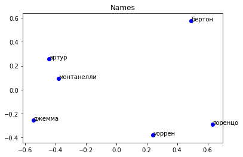

# Домашнее задание 3 - Марианна Мартиросян
## word2vec

Импортируем все, что нужно.


```python
import re
import gensim
import logging
import nltk
import nltk.data
import pandas as pd
import urllib.request
from pymystem3 import Mystem
from bs4 import BeautifulSoup
from nltk.corpus import stopwords
from gensim.models import word2vec
from nltk.tokenize import sent_tokenize
from nltk.tokenize import word_tokenize
from sklearn.decomposition import PCA
import matplotlib.pyplot as plt
%matplotlib inline

import warnings
warnings.filterwarnings('ignore')
```

1. Открываем текст, делим на предложения, лемматизируем каждое предложение, соединяем, кидаем в общий список, соединяем итоговый список в строку и записываем в файл.


```python
with open('owod.txt', encoding='utf-8') as f:
    text = f.read()
    
sentences = sent_tokenize(text)

sw = stopwords.words('russian')

m = Mystem()
lem_sents = []
for i in sentences:
    lemmas = m.lemmatize(i)
    words = [w.lower() for w in lemmas if w.isalpha()]
    filtered = [w for w in words if w not in sw]
    joined_sent= ' '.join(filtered)
    lem_sents.append(joined_sent)
joined_text = '\n'.join(lem_sents)

with open('owod_lem.txt', 'w', encoding='utf-8') as f:
    text = f.write(joined_text)
    
```

2. Обучаем модель. Открываем очищеный от всего ненужного файл с книгой, набираем нужные параметры, сохраняем модель. 


```python
f = 'owod_lem.txt'
data = gensim.models.word2vec.LineSentence(f)
```


```python
%time model_owod = gensim.models.Word2Vec(data, size=300, min_count=5, window=5, iter=50)
```

    CPU times: user 5.03 s, sys: 101 ms, total: 5.13 s
    Wall time: 3.06 s


```python
model_owod.init_sims(replace=True)
model_path = "owod.bin"

print("Saving model...")
model_owod.wv.save_word2vec_format(model_path, binary=True)
```

    Saving model...


Смотрим, сколько слов выучила модель


```python
print(len(model_owod.wv.vocab))
```

    1965


Собственно список слов. Можно раскомментить, чтобы посмотреть. Не стала удалять, тк часто пригождался. Может и вам захочется посмотреть


```python
#print(sorted([w for w in model_owod.wv.vocab]))

```

3.1 Найти ближайшие 5 слов для


а) животного


```python
model_owod.wv.most_similar('собака', topn=5)
```


    [('чай', 0.923905611038208),
     ('запирать', 0.9182689189910889),
     ('зажигать', 0.914858341217041),
     ('седло', 0.9105055332183838),
     ('свертывать', 0.9094663262367249)]


б) абстрактного понятия


```python
model_owod.wv.most_similar('необходимость', topn=5)
```


    [('республика', 0.9720183610916138),
     ('участник', 0.9658476114273071),
     ('печать', 0.9619404673576355),
     ('заслуживать', 0.9608818888664246),
     ('доказательство', 0.9602682590484619)]


в) имени главного героя


```python
model_owod.wv.most_similar('артур', topn=5)
```


    [('монтанелли', 0.7536370754241943),
     ('джемма', 0.6762948036193848),
     ('джеймс', 0.6729562282562256),
     ('надзиратель', 0.659629225730896),
     ('зита', 0.6543906927108765)]


г) прилагательных "хороший" и "плохой"


```python
model_owod.wv.most_similar('плохой', topn=5)
```


    [('поверять', 0.9065131545066833),
     ('интересовать', 0.902672529220581),
     ('занятый', 0.9023877382278442),
     ('опасаться', 0.8712626695632935),
     ('поступок', 0.870074450969696)]


```python
model_owod.wv.most_similar('хороший', topn=5)
```


    [('связь', 0.8039513826370239),
     ('применять', 0.7782725095748901),
     ('ложь', 0.768570601940155),
     ('риск', 0.7624050378799438),
     ('кость', 0.7616521120071411)]


3.2 Найти семантическую пропорцию


```python
model_owod.wv.most_similar(positive=["сын", "священник"], negative=["мальчик"], topn=1)
```


    [('бог', 0.6573776006698608)]


3.3 Найтиее лишнее в списке слов


```python
model_owod.wv.doesnt_match("мальчик поэт солдат хозяйка".split())
```


    'поэт'


 4. Визуализируем


```python
words = ['артур', 'бертон', 'монтанелли', 'джемма', 'уоррен', 'лоренцо']
X = model_owod[words]
```


```python
pca = PCA(n_components=2)
coords = pca.fit_transform(X)
```


```python
plt.scatter(coords[:, 0], coords[:, 1], color='blue')
plt.title('Names')

for i, word in enumerate(words):
    plt.annotate(word, xy=(coords[i, 0], coords[i, 1]))
plt.show()
```





В списке имена и фамилии героев. Артур Бертон, Лоренцо Монтанелли, Джемма Уоррен. По оси х слева от нуля оказались имена, а справа - фамилии (у Лоренцо Монанелли, наоборот, но справедливости ради его фамилия скорее употреблялась как имя - очень часто, Лоренцо - реже). Если смотреть сверху вниз, то имена идут почти в том же порядке, в каком - соответствующие им фамилии. (Лоренцо опять все испортил... а еще Бертон - фамилия не только Артура, но и его брата и жены его брата)

5. Берем предложение из книги, лемматизируем, меняем все леммы, которые есть в модели, на ближайшие по векторам. Остальные слова - служебные и те, которые не знает модель -  и пунктуацию оставляем.


```python
sentence = 'Джемма, дорогая, я привела синьора Ривареса, чтобы показать ему, какой отсюда открывается чудесный вид.'
lemmas = m.lemmatize(sentence)
print('Original sentence: ', sentence)
print('Original lemmatized sentence: ', ''.join(lemmas))

new_sent = []
for lem in lemmas:
    if lem in model_owod.wv.vocab:
        new_lem = model_owod.wv.most_similar(lem, topn=1)[0][0]
        new_sent.append(new_lem)
    else: 
        new_sent.append(lem)
print('New sentence: ', ''.join(new_sent))
```

    Original sentence:  Джемма, дорогая, я привела синьора Ривареса, чтобы показать ему, какой отсюда открывается чудесный вид.
    Original lemmatized sentence:  джемма, дорогой, я приводить синьора риварес, чтобы показывать он, какой отсюда открываться чудесный вид.
    
    New sentence:  мартини, наедине, я спорить галли устраивать, чтобы призрак он, какой предупреждать чудесный открываться труд.
    


The end.
